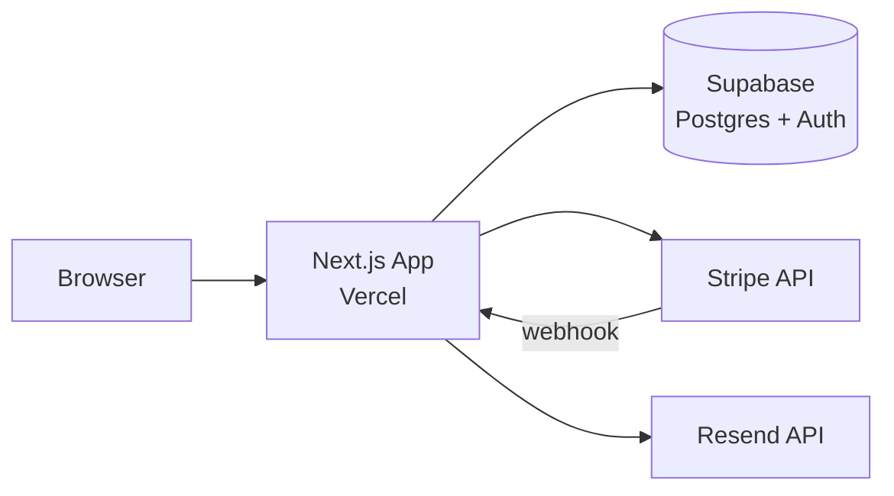

# Documentation Anti-Slop Guide

A catalog of patterns that make AI-generated documentation look AI-generated, with before/after rewrites. This exists because documentation is the most common place AI produces confident-sounding emptiness — and unlike code, slop in docs doesn't throw errors. It just wastes everyone's time.

---

## The Core Problem

AI documentation slop passes two deceptive tests: it looks professional and it sounds complete. A manager reading it thinks "this covers everything." A developer reading it thinks "this tells me nothing." The difference is that slop describes categories of information without providing the information itself.

**The fundamental tell**: AI documentation talks ABOUT the project. Expert documentation talks FROM the project. One is a book report. The other is a field guide.

---

## Pattern 1: The Empty Introduction

### What It Looks Like

> "This document provides a comprehensive overview of the project's architecture, key components, and implementation details. It is intended to serve as a reference for developers working on or maintaining the system."

### Why It's Slop

Two sentences, zero information. You could paste this into any project's documentation and it would be equally true — which means it's equally useless. The reader already knows they're reading documentation. They don't need you to announce it.

### How to Fix It

Start with the first piece of actual information:

> "InvoiceTracker is a Next.js 14 app that lets freelancers create, send, and track invoices. It uses Supabase for auth and database, Stripe for payments, and Resend for email notifications. Currently deployed on Vercel with ~200 active users."

The fix introduces: project name, framework version, purpose, tech stack, external services, deployment platform, and scale — in three sentences.

### The Rule

**Delete your introduction.** If the document still makes sense, it was slop. If it doesn't, you cut too deep — add back only the information that was missing.

---

## Pattern 2: The Taxonomy Masquerading as Architecture

### What It Looks Like

> "The application follows a layered architecture with clear separation of concerns:
> - **Presentation Layer**: Handles user interface and user interaction
> - **Business Logic Layer**: Contains core application logic and rules
> - **Data Access Layer**: Manages database operations and data persistence
> - **Integration Layer**: Handles communication with external services"

### Why It's Slop

This is a textbook definition of layered architecture, not a description of THIS project's architecture. It applies to every web app ever built. The reader learns nothing about how THIS codebase is organized.

### How to Fix It

Describe the actual project structure:

> "The app is a standard Next.js App Router project:
> - `app/` — Route handlers and page components. Auth-gated routes live under `app/(dashboard)/`, public routes under `app/(marketing)/`.
> - `lib/` — Shared code. `lib/db.ts` is the Prisma client, `lib/stripe.ts` wraps Stripe API calls, `lib/email.ts` handles Resend templates.
> - `components/` — React components organized by feature (`components/invoices/`, `components/dashboard/`), not by type.
>
> There's no explicit "service layer" — route handlers call Prisma directly for simple CRUD operations. Complex operations (like creating an invoice + sending email + updating Stripe) go through functions in `lib/actions/`."

The fix names real directories, explains the actual pattern (including where it deviates from textbook architecture), and calls out a specific design decision.

### The Rule

**If your architecture description could apply to more than one project, you're describing a category, not a system.** Name files, folders, and decisions.

---

## Pattern 3: The Feature List That Restates Existence

### What It Looks Like

> "Key Features:
> - User authentication and authorization
> - Dashboard with data visualization
> - CRUD operations for core entities
> - Email notification system
> - Role-based access control
> - Responsive design
> - RESTful API endpoints"

### Why It's Slop

Every feature is described at the category level. "User authentication" tells you nothing. With what provider? What methods? OAuth? Magic link? Password? "CRUD operations for core entities" — what entities? "Email notification system" — for what events? Using what service?

### How to Fix It

> "What the app does:
> - **Auth**: Google and GitHub OAuth via NextAuth. No email/password — deliberate choice to avoid password management. Session-based, not JWT.
> - **Invoices**: Create invoices with line items, tax rates, and discount codes. Generate shareable PDF links. Track payment status (draft → sent → viewed → paid → overdue).
> - **Dashboard**: Revenue chart (monthly, last 12 months), outstanding amount, overdue count. Data refreshes on page load, no real-time.
> - **Emails**: Sends via Resend on three events: invoice sent (to client), invoice paid (to freelancer), invoice overdue 3 days (to freelancer). Templates in `lib/email/templates/`.
> - **Permissions**: Two roles — owner (full access) and accountant (read-only + export). No team/org model yet."

Every bullet now describes what the feature actually does in this project, with enough specificity that a developer can find the code.

### The Rule

**For each feature, answer: what specifically does it do, with what technology, and where does it live in the code?**

---

## Pattern 4: The Non-Specific Tech Stack Table

### What It Looks Like

> | Technology | Purpose |
> |-----------|---------|
> | React | Frontend UI framework |
> | Node.js | Backend runtime |
> | PostgreSQL | Database |
> | Redis | Caching |
> | Docker | Containerization |

### Why It's Slop

The "Purpose" column states what the technology IS, not why it was CHOSEN or how it's USED in this project. "React — Frontend UI framework" is a dictionary definition. Anyone who knows React already knows this. Anyone who doesn't is not your audience.

### How to Fix It

> | Technology | How It's Used | Why This Choice |
> |-----------|---------------|-----------------|
> | Next.js 14 (App Router) | Full-stack framework — SSR for marketing pages, client components for dashboard | Needed both static marketing pages and dynamic app UI. App Router for RSC on data-heavy pages. |
> | Supabase (Postgres) | Auth, database, row-level security | Solo project — Supabase gives auth + DB + RLS without separate infra. Free tier covers current scale (~200 users). |
> | Redis (Upstash) | Rate limiting on API routes, session store | Vercel has no persistent storage. Upstash serverless Redis has a generous free tier and works edge-native. |
> | Docker | Local development only (Postgres + Redis) | Not used in production (Vercel + Supabase + Upstash are all managed). Docker Compose for consistent dev env. |

Now each row tells you: what version, how it's used in this project specifically, and the reasoning behind the choice.

### The Rule

**The "Why" column is mandatory. If you can't articulate why THIS project uses THIS technology, you haven't read the codebase deeply enough.**

---

## Pattern 5: The Generic Getting Started

### What It Looks Like

> "## Getting Started
> 1. Clone the repository
> 2. Install dependencies
> 3. Set up environment variables
> 4. Run the development server"

### Why It's Slop

These four steps apply to every project in existence. A developer reading this has zero new information. They still have to figure out: which package manager? Which env vars? What values? Any database setup? What port?

### How to Fix It

> "## Running Locally
>
> Prerequisites: Node 20+, pnpm (not npm — the lockfile is pnpm)
>
> ```bash
> git clone https://github.com/user/invoice-tracker
> cd invoice-tracker
> pnpm install
> cp .env.example .env
> ```
>
> Fill in `.env`:
> - `DATABASE_URL` — Supabase connection string (get from Supabase dashboard → Settings → Database)
> - `NEXTAUTH_SECRET` — any random string (`openssl rand -base64 32`)
> - `GOOGLE_CLIENT_ID` / `GOOGLE_CLIENT_SECRET` — from Google Cloud Console (OAuth 2.0)
> - `STRIPE_SECRET_KEY` — from Stripe dashboard (use test mode key)
> - `RESEND_API_KEY` — from Resend dashboard (optional — emails log to console without it)
>
> ```bash
> pnpm db:push          # apply schema to database
> pnpm db:seed          # seed with sample data (3 clients, 12 invoices)
> pnpm dev              # starts on http://localhost:3000
> ```
>
> First login: use Google OAuth. The first user automatically gets the 'owner' role."

Every step has the actual command, actual env vars with where to get them, and notes on behavior.

### The Rule

**A Getting Started section is testable. If a developer follows it literally and the app doesn't run, the docs failed.**

---

## Pattern 6: The Aspirational Future Section

### What It Looks Like

> "## Future Enhancements
> - Implement advanced analytics dashboard
> - Add multi-language support
> - Enhance security with two-factor authentication
> - Integrate machine learning for predictive insights
> - Improve performance optimization
> - Add comprehensive test coverage"

### Why It's Slop

This is a wish list with no substance. "Advanced analytics dashboard" — what analytics? "Machine learning for predictive insights" — predicting what? "Performance optimization" — optimizing what, which is currently slow? These sound impressive and communicate nothing.

### How to Fix It

Either be specific or cut the section:

> "## Known Gaps / What's Missing
>
> - **No tests.** Zero test coverage. If adding tests, start with the invoice creation flow (`lib/actions/create-invoice.ts`) — it has the most business logic.
> - **No email verification.** OAuth handles identity, but nothing prevents someone from creating invoices for email addresses they don't own. Not a problem at current scale; becomes one with shared teams.
> - **PDF generation is slow.** `lib/pdf.ts` uses `@react-pdf/renderer` synchronously in the API route. Above ~50 line items, it times out on Vercel's 10s limit. Needs to move to a background job or a dedicated PDF service.
> - **No recurring invoices.** Frequently requested. The data model supports it (add `recurrence_rule` to invoices table), but the scheduler isn't built."

Each item names the actual gap, explains why it matters, and hints at a fix direction.

### The Rule

**"Future" sections must name real gaps with real consequences. If the reader can't decide whether to fix it this sprint, the description is too vague.**

---

## Pattern 7: The Redundant Section Padding

### What It Looks Like

A document with sections like:
- 1. Introduction
- 2. Purpose
- 3. Scope
- 4. Background
- 5. Overview
- 6. System Description

...all saying variations of the same thing before any real content begins.

### Why It's Slop

Five sections of preamble before the first useful fact. The reader has to wade through meta-content to find content. Each section slightly rephrases "what this project is and why we're documenting it."

### How to Fix It

One section. Call it whatever you want — the point is to say what the project is and move on.

> "# InvoiceTracker
>
> A Next.js app for freelance invoice management. Create invoices, track payments, get email reminders for overdue ones. Built for solo freelancers — no team features, no multi-org. Currently used by ~200 freelancers."

Then proceed directly to the next useful section (architecture, features, setup — whatever the document type calls for).

### The Rule

**If you catch yourself writing "the purpose of this document is..." you're writing meta-content. The purpose of the document is its content. Start writing it.**

---

## Pattern 8: The Diagram Description Instead of a Diagram

### What It Looks Like

> "The system architecture consists of a frontend client that communicates with a backend API server. The API server processes requests and interacts with the database for data storage and retrieval. External services are integrated for payment processing and email delivery."

### Why It's Slop

You just described what an architecture diagram would show, without providing the diagram. The reader has to mentally construct the visual from a paragraph of text — and probably gets it wrong because the paragraph omits connection details.

### How to Fix It

Include an actual diagram:



If you can't render a diagram (no Mermaid support), use ASCII:

```
Browser → Next.js (Vercel) → Supabase (Postgres + Auth)
                            → Stripe API (payments)
                            → Resend API (emails)
                            ← Stripe webhooks
```

Both of these communicate more than the paragraph did, in less space.

### The Rule

**If you're describing a visual relationship (A connects to B, data flows from X to Y), draw it. If you can't draw it, use ASCII art. Never describe a diagram in prose.**

---

## The Master Slop Test

Before delivering any document, run every section through:

1. **The Swap Test** — Copy this section into a different project's docs. Does it still make sense? If yes, it's not specific enough.
2. **The Developer Test** — Would a developer joining tomorrow learn something actionable from this? If no, cut or rewrite.
3. **The Deletion Test** — Delete this section. Does the document lose real information? If no, it was filler.
4. **The "So What?" Test** — After reading this sentence, can the reader do something they couldn't before? If no, it's not earning its space.
5. **The Tone Test** — Read it aloud. Does it sound like a person who built this project talking about it? Or does it sound like a Wikipedia article about the category of software this project belongs to? If Wikipedia, rewrite.

### The One-Line Gut Check

> **"Am I documenting THIS project, or am I documenting the TYPE of project this is?"**

If you're documenting the type, you're writing slop. Stop, re-read the codebase, and write about what you actually found.
