# Diagram Patterns for Documentation

Mermaid diagram patterns for common documentation scenarios. Use these as starting points — adapt to the actual project structure.

**Rule**: A diagram earns its place only if it communicates relationships that prose cannot efficiently convey. Don't diagram what a bullet list can say.

---

## When to Use Diagrams

| Scenario | Diagram Type | When to Skip |
|----------|-------------|--------------|
| 3+ components communicating | Architecture / Component | If it's just "frontend → backend → DB" — a sentence suffices |
| Multi-step user flow | Sequence | If it's linear with no branching — use numbered list |
| Data relationships | ER Diagram | If <3 entities with obvious relations |
| Deployment topology | Deployment | If single-platform deploy (just Vercel, just Heroku) |
| State transitions | State Diagram | If <3 states |
| Decision logic | Flowchart | If it's a simple if/else — use prose |

---

## Architecture / Component Diagram

Shows how major system components connect.

### Pattern: Web App with External Services

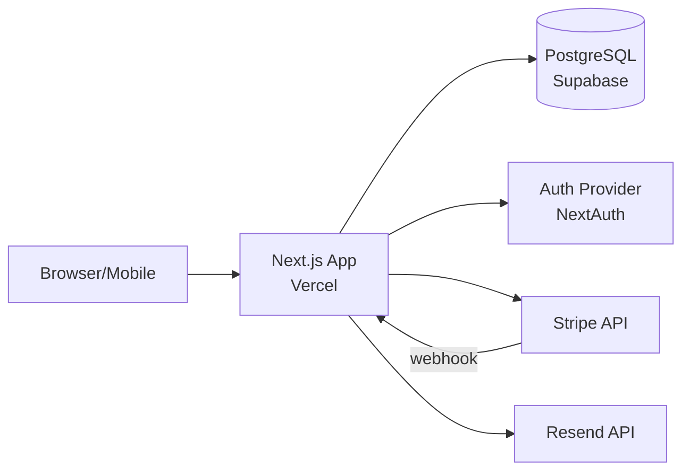

### Pattern: Microservices

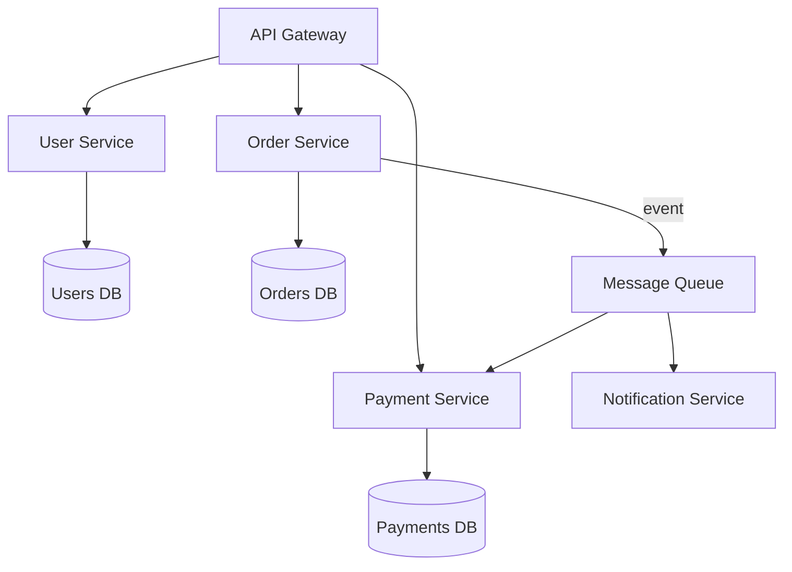

### Pattern: Serverless / Event-Driven

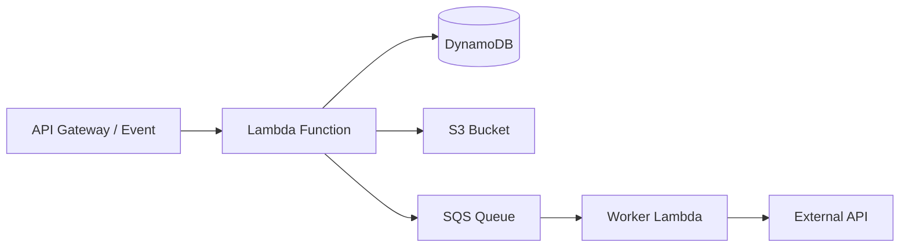

### Best Practices

- Label nodes with **what it is** + **what technology**: `App[Next.js App Vercel]` not just `App`
- Show direction of data flow with arrows
- Mark async/webhook connections distinctly: `-->|webhook|` or `-.->|async|`
- Max 8-10 nodes per diagram. If more, split into sub-diagrams.
- Use `[(  )]` for databases, `[  ]` for services, `{  }` for decisions

---

## Sequence Diagram

Shows how components interact over time for a specific flow.

### Pattern: API Request with Auth

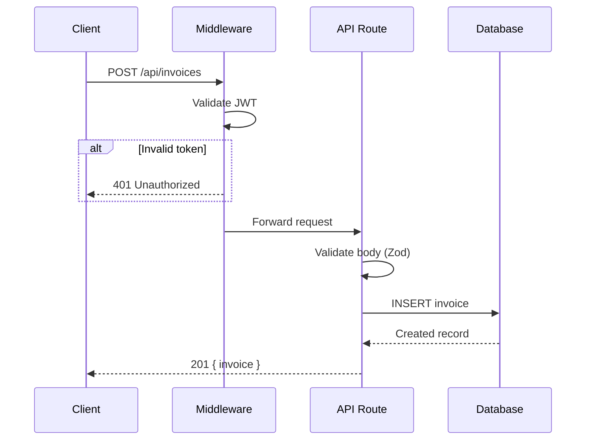

### Pattern: OAuth Flow

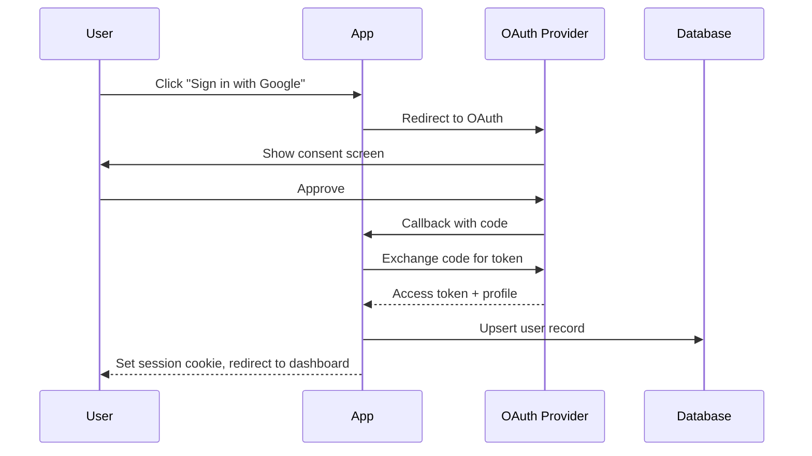

### Pattern: Webhook Processing

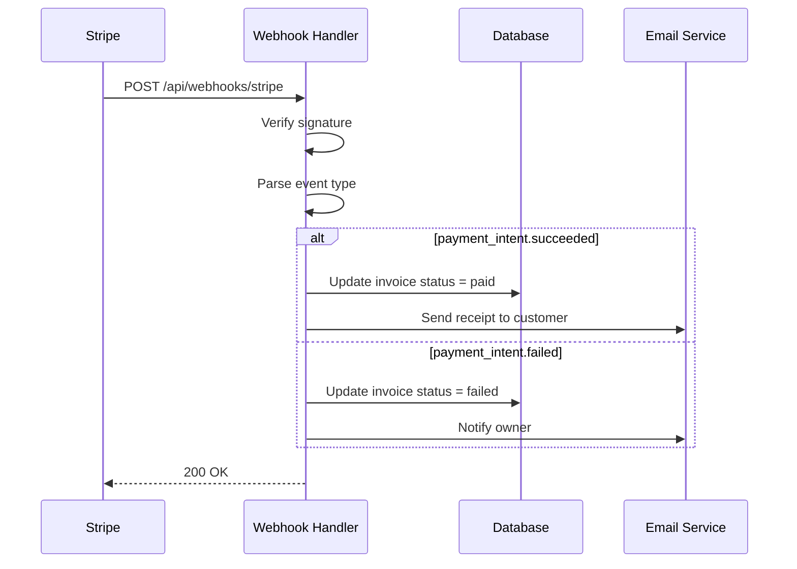

### Best Practices

- Name participants with short aliases + full name: `participant C as Client`
- Show error/alt paths — they're the most valuable part
- Keep to one flow per diagram. "User creates invoice" is one diagram, "User pays invoice" is another.
- Max 6 participants. If more, you're diagramming too much at once.

---

## Entity-Relationship Diagram

Shows data model relationships.

### Pattern: Basic Relations

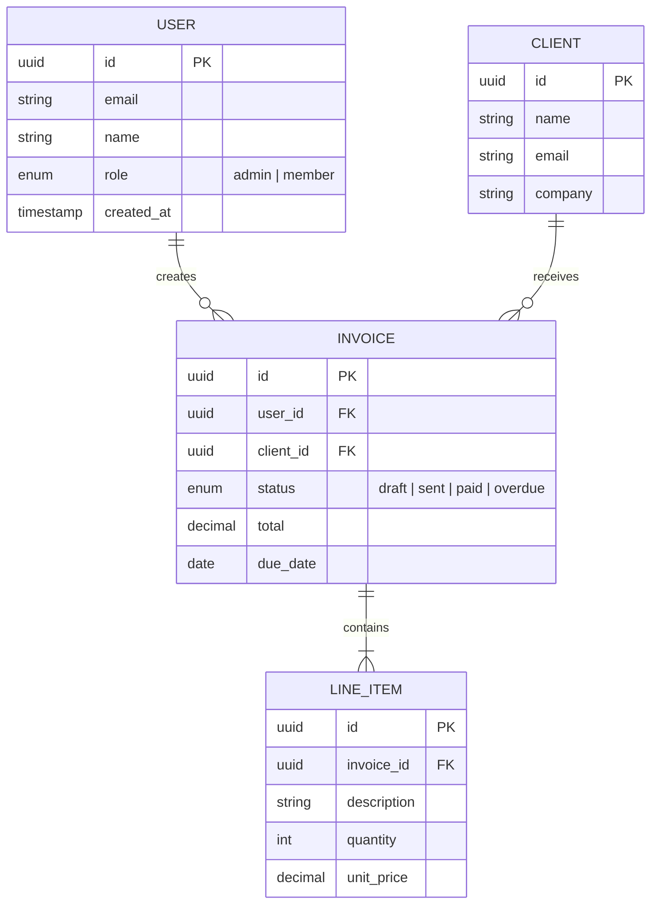

### Best Practices

- Include field types and constraints — not just entity names
- Mark PK/FK explicitly
- Show cardinality: `||--o{` (one-to-many), `||--||` (one-to-one), `}o--o{` (many-to-many)
- Only include entities relevant to the section being documented. Full schema → separate Database Documentation.
- Add enum values inline when they're important for understanding the domain

---

## Deployment Diagram

Shows infrastructure topology.

### Pattern: Typical Jamstack/Serverless

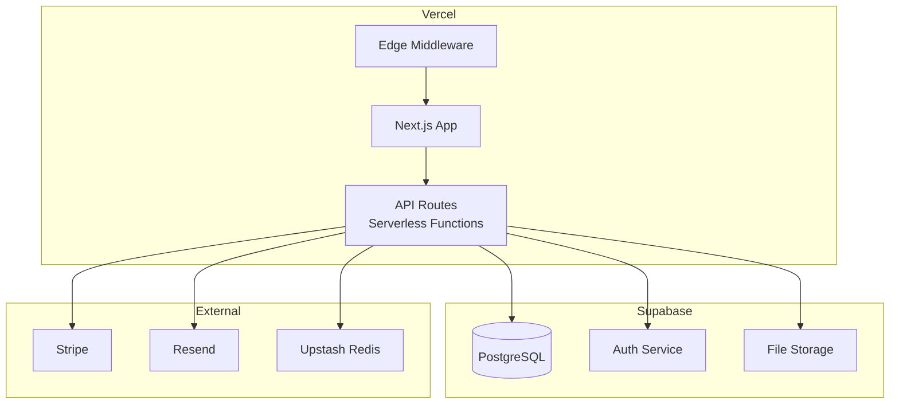

### Pattern: Container-Based

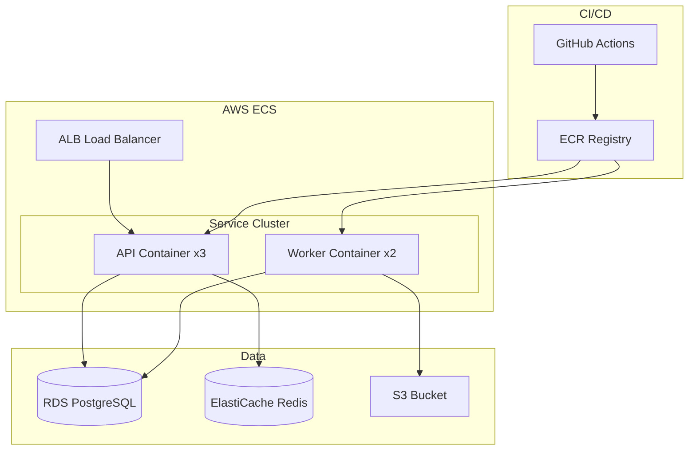

### Best Practices

- Use `subgraph` to group by provider/environment
- Include scaling info: `x3`, `x2` for replicas
- Show CI/CD pipeline if it's part of the deployment story
- Label connections only when the protocol matters: `-->|HTTPS|`, `-->|gRPC|`

---

## State Diagram

Shows entity lifecycle transitions.

### Pattern: Order/Invoice Status

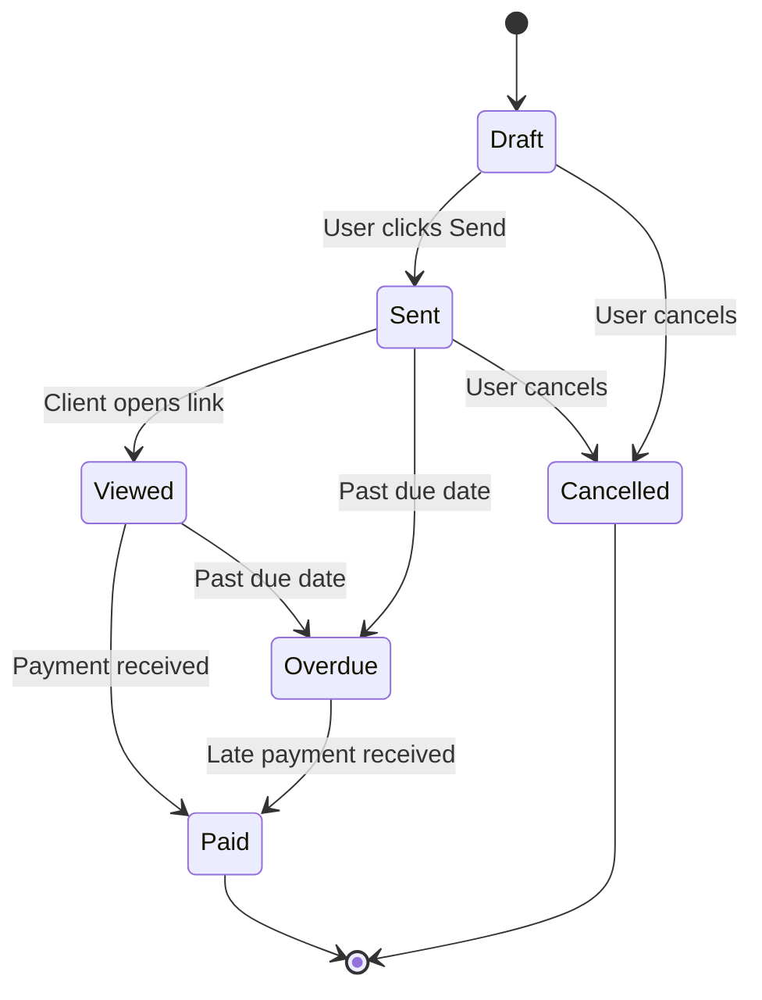

### Best Practices

- Label transitions with the trigger/event, not just the target state
- Show terminal states clearly with `[*]`
- Include error/cancel paths — they're often undocumented in code
- Keep to one entity per diagram

---

## Flowchart

Shows decision logic or process flow.

### Pattern: Request Processing Pipeline

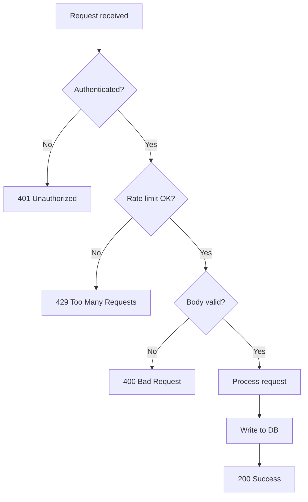

### Best Practices

- Use `{  }` for decision nodes, `[  ]` for actions, `(  )` for start/end
- Keep decisions binary when possible (Yes/No)
- Don't flowchart simple linear processes — use a numbered list instead
- Max 12 nodes. If more, break into sub-processes.

---

## Anti-Patterns

### Don't Do This

1. **The Everything Diagram** — One massive diagram showing every component, every connection, every database table. Nobody can read it. Split by concern.

2. **The Obvious Diagram** — Diagramming `Browser → Server → Database` adds nothing. Only diagram when there are non-obvious connections or multiple paths.

3. **The Unlabeled Diagram** — Nodes named `Service A`, `Service B`, `Database`. Use real names from the codebase.

4. **The Stale Diagram** — A diagram that doesn't match the code is worse than no diagram. When updating docs, verify diagrams still reflect reality.

5. **The Prose Diagram** — Putting full sentences inside nodes. Keep node labels to 2-4 words. Use notes or surrounding text for explanation.

### Size Rules

- **Architecture**: Max 10 nodes
- **Sequence**: Max 6 participants, max 15 messages
- **ER**: Max 8 entities per diagram (split by domain if larger)
- **Flowchart**: Max 12 nodes
- **State**: Max 8 states
